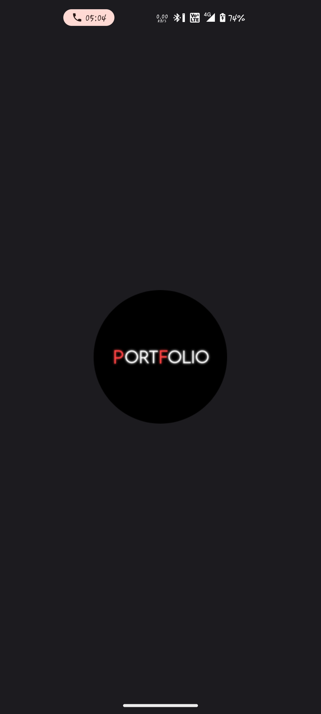
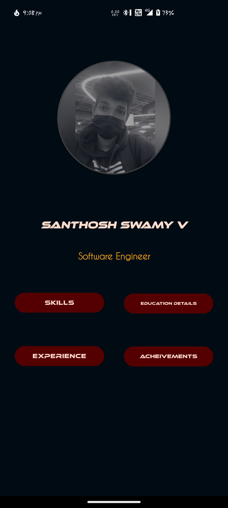
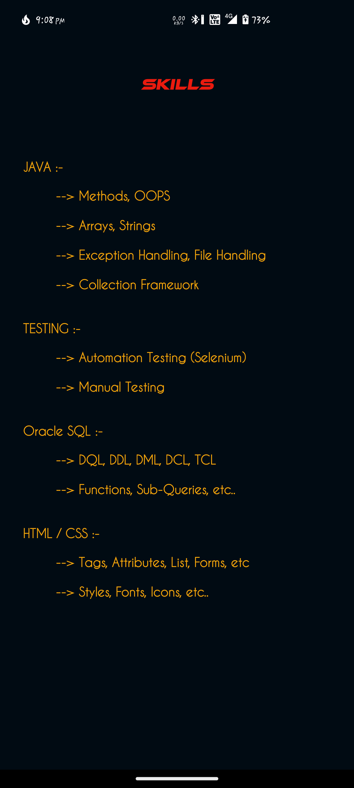
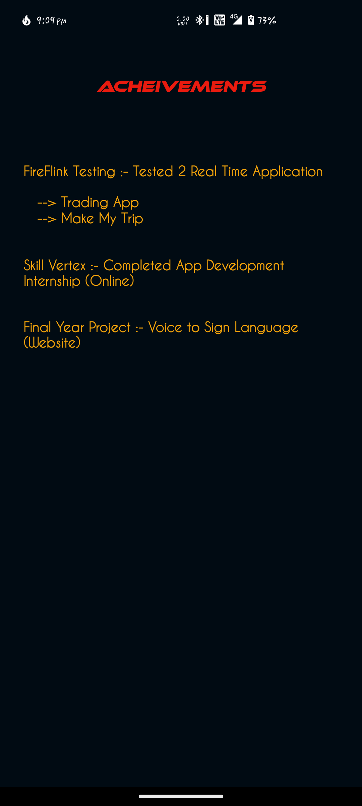
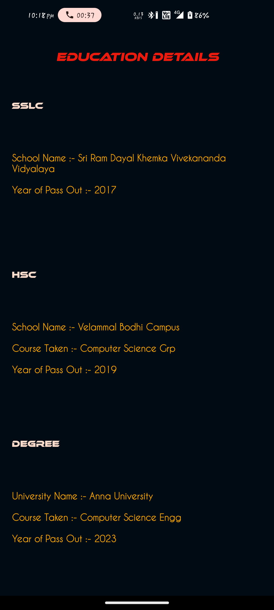
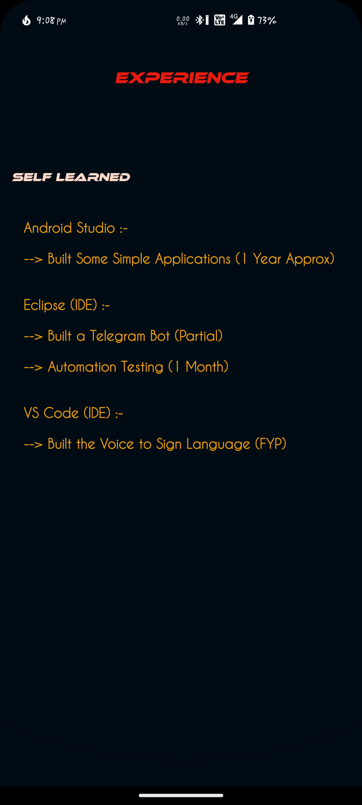

# *PortFolio*


## Screenshots

**Laucher**



**Activity**



**Working**



**Working**



**Working**



**Working**


## Developed Using

**IDE :** Android Studio

**Language :** Kotlin 


## To Run the Project

*Clone the project*

```bash
  git clone https://link-to-project

```
*Import the Project in Android Studio and Edit & Build*

*or*

*Go to the project directory*

```bash
  cd Application-(Apk)
  install app-debug.apk
```


## 🔗 Links & Support
[](santhoshswamyv@gmail.com/)

[](https://www.linkedin.com/in/santhosh-swamy-v-22ab6b234)

[](sd._.sandy)

[](+918754120190)

